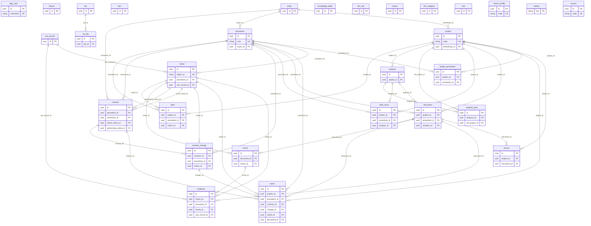
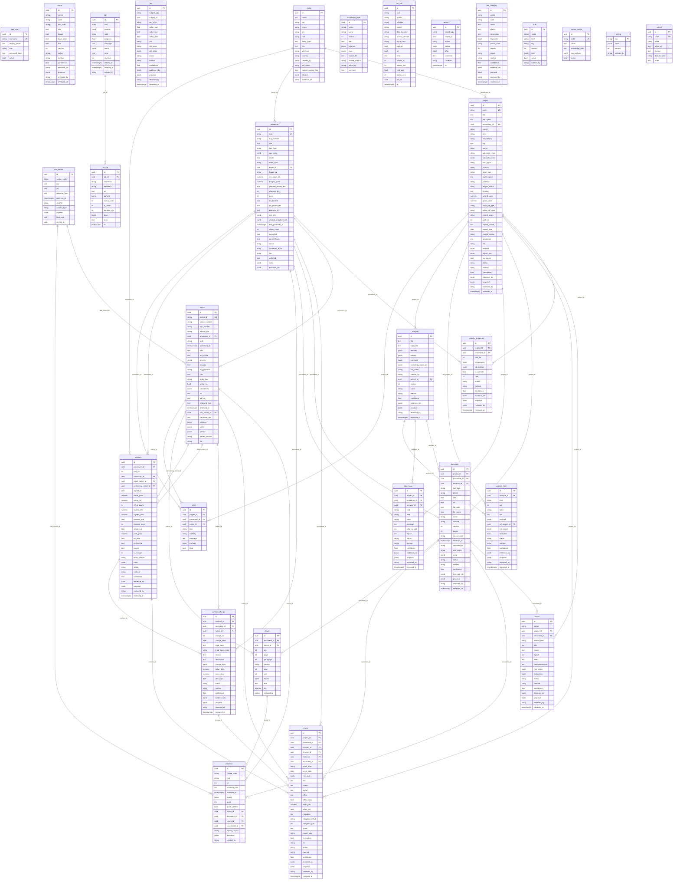

# ERD – schemat bazy (wygenerowany)

Generowany z `backend/riskminer/models/tables.py`: `uv run riskminer docs-gen`.

## Widok skrócony (klucze i relacje)

```mermaid
erDiagram
    app_user {
        uuid id PK
        string username UK
    }
    clause {
        uuid id PK
    }
    entity {
        uuid id PK
    }
    fact {
        uuid id PK
    }
    job {
        uuid id PK
    }
    knowledge_table {
        uuid id PK
    }
    llm_call {
        uuid id PK
    }
    raw_record {
        uuid id PK
    }
    review {
        uuid id PK
    }
    risk_category {
        uuid id PK
    }
    rule {
        uuid id PK
    }
    sector_profile {
        uuid id PK
        string code UK
    }
    setting {
        string key PK
    }
    source {
        uuid id PK
        string code UK
    }
    op_log {
        uuid id PK
        uuid job_id FK
    }
    procedure {
        uuid id PK
        string ocid UK
        uuid buyer_id FK
    }
    project {
        uuid id PK
        string code UK
        uuid beneficiary_id FK
    }
    analysis {
        uuid id PK
        uuid project_id FK
    }
    notice {
        uuid id PK
        string object_id UK
        uuid procedure_id FK
        uuid raw_record_id FK
    }
    project_procedure {
        uuid id PK
        uuid project_id FK
        uuid procedure_id FK
    }
    alert {
        uuid id PK
        uuid project_id FK
        uuid procedure_id FK
        uuid notice_id FK
    }
    analysis_item {
        uuid id PK
        uuid analysis_id FK
        uuid ref_project_id FK
    }
    contract {
        uuid id PK
        uuid procedure_id FK
        uuid contractor_id FK
        uuid result_notice_id FK
        uuid performing_notice_id FK
    }
    data_issue {
        uuid id PK
        uuid project_id FK
        uuid procedure_id FK
        uuid analysis_id FK
    }
    document {
        uuid id PK
        uuid project_id FK
        uuid procedure_id FK
        uuid analysis_id FK
    }
    chunk {
        uuid id PK
        uuid document_id FK
        uuid notice_id FK
    }
    contract_change {
        uuid id PK
        uuid contract_id FK
        uuid procedure_id FK
        uuid notice_id FK
    }
    lesson {
        uuid id PK
        uuid project_id FK
        uuid document_id FK
    }
    event {
        uuid id PK
        uuid project_id FK
        uuid procedure_id FK
        uuid contract_id FK
        uuid change_id FK
        uuid notice_id FK
        uuid document_id FK
    }
    evidence {
        uuid id PK
        uuid notice_id FK
        uuid document_id FK
        uuid chunk_id FK
        uuid raw_record_id FK
    }
    analysis ||--o{ analysis_item : "analysis_id"
    analysis ||--o{ data_issue : "analysis_id"
    analysis ||--o{ document : "analysis_id"
    chunk ||--o{ evidence : "chunk_id"
    contract ||--o{ contract_change : "contract_id"
    contract ||--o{ event : "contract_id"
    contract_change ||--o{ event : "change_id"
    document ||--o{ chunk : "document_id"
    document ||--o{ event : "document_id"
    document ||--o{ evidence : "document_id"
    document ||--o{ lesson : "document_id"
    entity ||--o{ contract : "contractor_id"
    entity ||--o{ procedure : "buyer_id"
    entity ||--o{ project : "beneficiary_id"
    job ||--o{ op_log : "job_id"
    notice ||--o{ alert : "notice_id"
    notice ||--o{ chunk : "notice_id"
    notice ||--o{ contract : "performing_notice_id"
    notice ||--o{ contract : "result_notice_id"
    notice ||--o{ contract_change : "notice_id"
    notice ||--o{ event : "notice_id"
    notice ||--o{ evidence : "notice_id"
    procedure ||--o{ alert : "procedure_id"
    procedure ||--o{ contract : "procedure_id"
    procedure ||--o{ contract_change : "procedure_id"
    procedure ||--o{ data_issue : "procedure_id"
    procedure ||--o{ document : "procedure_id"
    procedure ||--o{ event : "procedure_id"
    procedure ||--o{ notice : "procedure_id"
    procedure ||--o{ project_procedure : "procedure_id"
    project ||--o{ alert : "project_id"
    project ||--o{ analysis : "project_id"
    project ||--o{ analysis_item : "ref_project_id"
    project ||--o{ data_issue : "project_id"
    project ||--o{ document : "project_id"
    project ||--o{ event : "project_id"
    project ||--o{ lesson : "project_id"
    project ||--o{ project_procedure : "project_id"
    raw_record ||--o{ evidence : "raw_record_id"
    raw_record ||--o{ notice : "raw_record_id"
```

## Pełny schemat

```mermaid
erDiagram
    app_user {
        uuid id PK
        string username UK
        text display_name
        string role
        text password_hash
        bool active
    }
    clause {
        uuid id PK
        string sector
        string code
        string risk_code
        text title
        text trigger
        text legal_basis
        text text
        int version
        string status
        string method
        float confidence
        jsonb evidence_ids
        jsonb proposal
        string reviewed_by
        timestamptz reviewed_at
    }
    entity {
        uuid id PK
        text name
        string nip
        string regon
        string krs
        string role
        text entity_type
        text city
        string province
        string country
        jsonb verified_by
        string vat_status
        bool natural_person_flag
        jsonb aliases
        jsonb evidence_ids
    }
    fact {
        uuid id PK
        string subject_type
        uuid subject_id
        string fact_type
        float value_num
        text value_text
        date value_date
        string unit
        string vat_basis
        jsonb derivation
        string status
        string method
        float confidence
        jsonb evidence_ids
        jsonb proposal
        string reviewed_by
        timestamptz reviewed_at
    }
    job {
        uuid id PK
        string kind
        jsonb params
        string state
        float progress
        text message
        jsonb result
        text error
        int attempts
        timestamptz started_at
        timestamptz finished_at
        string created_by
    }
    knowledge_table {
        uuid id PK
        string sector
        string name
        int version
        text title
        jsonb columns
        jsonb rows
        text source_file
        string source_sha256
        string edited_by
        text comment
    }
    llm_call {
        uuid id PK
        string task
        string profile
        string provider
        string model
        string data_location
        string prompt_version
        string input_hash
        bool cached
        bool ok
        text error
        int tokens_in
        int tokens_out
        float cost_usd
        int latency_ms
        uuid job_id
        timestamptz at
    }
    raw_record {
        uuid id PK
        string source_code
        text key
        text url
        text retrieved_from
        timestamptz retrieved_at
        string sha256
        string content_type
        jsonb payload
        text blob_path
        uuid op_log_id
    }
    review {
        uuid id PK
        string object_type
        uuid object_id
        string action
        jsonb before
        jsonb after
        text comment
        string reviewer
        timestamptz at
    }
    risk_category {
        uuid id PK
        string sector
        string code
        text name
        text effects
        text description
        jsonb keywords
        string parent_code
        int version
        string status
        string method
        float confidence
        jsonb evidence_ids
        jsonb proposal
        string reviewed_by
        timestamptz reviewed_at
    }
    rule {
        uuid id PK
        string sector
        string kind
        string key
        int version
        jsonb body
        bool active
        string created_by
    }
    sector_profile {
        uuid id PK
        string code UK
        text name
        text knowledge_path
        jsonb cpv_prefixes
        bool active
    }
    setting {
        string key PK
        jsonb value
        int version
        string updated_by
    }
    source {
        uuid id PK
        string code UK
        string name
        text base_url
        text licence
        string data_location
        text notes
    }
    op_log {
        uuid id PK
        uuid job_id FK
        string connector
        string operation
        text url
        jsonb params
        int status_code
        int n_results
        int duration_ms
        bigint bytes
        text error
        timestamptz at
    }
    procedure {
        uuid id PK
        string ocid UK
        string bzp_number
        text title
        string cpv_main
        jsonb cpv_extra
        text mode
        string order_type
        uuid buyer_id FK
        string buyer_nip
        numeric est_value_net
        numeric budget_gross
        text planned_period_text
        int planned_days
        int parts
        bool eu_funded
        text eu_project_ref
        text platform_url
        jsonb ted_refs
        jsonb related_procedure_ids
        timestamptz first_published_at
        int offers_count
        bool cancelled
        text cancel_basis
        string sector
        string subsector_main
        string tier
        bool watched
        jsonb meta
        jsonb evidence_ids
    }
    project {
        uuid id PK
        string code UK
        text title
        text description
        uuid beneficiary_id FK
        string country
        string teryt
        string voivodeship
        text city
        string sector
        string subsector_main
        jsonb subsector_extra
        string work_type
        string formula
        string order_type
        text legal_regime
        string currency
        string project_status
        text funding
        numeric project_value
        numeric grant_value
        string public_id_type
        string public_id_value
        string record_scope
        int part_no
        text record_source
        date record_date
        string record_version
        text annotation
        string tier
        jsonb features
        jsonb import_row
        bool exemplary
        string status
        string method
        float confidence
        jsonb evidence_ids
        jsonb proposal
        string reviewed_by
        timestamptz reviewed_at
    }
    analysis {
        uuid id PK
        text title
        text input_text
        jsonb features
        jsonb params
        jsonb summary
        jsonb excluded_project_ids
        string llm_profile
        string created_by
        uuid project_id FK
        int version
        string status
        string method
        float confidence
        jsonb evidence_ids
        jsonb proposal
        string reviewed_by
        timestamptz reviewed_at
    }
    notice {
        uuid id PK
        string object_id UK
        string notice_number
        string bzp_number
        string notice_type
        uuid procedure_id FK
        string ocid
        timestamptz published_at
        text title
        text org_name
        string org_nip
        text org_city
        string org_province
        text cpv
        string order_type
        bool below_eu
        jsonb contractors
        text url
        text pdf_url
        text retrieved_from
        timestamptz retrieved_at
        uuid raw_record_id FK
        text canonical_text
        jsonb sections
        jsonb xrefs
        jsonb parsed
        string parser_version
        string tier
    }
    project_procedure {
        uuid id PK
        uuid project_id FK
        uuid procedure_id FK
        int part_no
        jsonb components
        jsonb alternatives
        bool is_override
        int rank
        string status
        string method
        float confidence
        jsonb evidence_ids
        jsonb proposal
        string reviewed_by
        timestamptz reviewed_at
    }
    alert {
        uuid id PK
        uuid project_id FK
        uuid procedure_id FK
        uuid notice_id FK
        string kind
        string severity
        text message
        jsonb payload
        bool read
    }
    analysis_item {
        uuid id PK
        uuid analysis_id FK
        string kind
        int ord
        string label
        text title
        jsonb payload
        uuid ref_project_id FK
        jsonb risk_codes
        bool excluded
        string status
        string method
        float confidence
        jsonb evidence_ids
        jsonb proposal
        string reviewed_by
        timestamptz reviewed_at
    }
    contract {
        uuid id PK
        uuid procedure_id FK
        int part_no
        uuid contractor_id FK
        uuid result_notice_id FK
        uuid performing_notice_id FK
        date signed_at
        numeric value_gross
        numeric value_net
        int offers_count
        numeric lowest_offer
        numeric highest_offer
        date planned_end
        int planned_days
        date actual_end
        numeric paid_gross
        bool on_time
        bool performed
        bool proper
        int n_changes
        string terms_source
        jsonb meta
        string status
        string method
        float confidence
        jsonb evidence_ids
        jsonb proposal
        string reviewed_by
        timestamptz reviewed_at
    }
    data_issue {
        uuid id PK
        uuid project_id FK
        uuid procedure_id FK
        uuid analysis_id FK
        string kind
        string field
        string state
        text message
        text what_to_add
        text impact
        string status
        string method
        float confidence
        jsonb evidence_ids
        jsonb proposal
        string reviewed_by
        timestamptz reviewed_at
    }
    document {
        uuid id PK
        uuid project_id FK
        uuid procedure_id FK
        uuid analysis_id FK
        string doc_type
        string phase
        text title
        text url
        text file_path
        text file_name
        string mime
        string sha256
        int version
        int pages
        string source_code
        timestamptz retrieved_at
        string uploaded_by
        string text_status
        jsonb meta
        string status
        string method
        float confidence
        jsonb evidence_ids
        jsonb proposal
        string reviewed_by
        timestamptz reviewed_at
    }
    chunk {
        uuid id PK
        uuid document_id FK
        uuid notice_id FK
        int ord
        int page
        int paragraph
        string section
        int start
        int end
        jsonb locator
        text text
        tsvector tsv
        vector embedding
    }
    contract_change {
        uuid id PK
        uuid contract_id FK
        uuid procedure_id FK
        uuid notice_id FK
        int change_no
        date change_date
        text legal_basis
        string legal_basis_code
        text reason
        text description
        jsonb change_kind
        numeric value_delta
        numeric new_value
        date new_end
        string status
        string method
        float confidence
        jsonb evidence_ids
        jsonb proposal
        string reviewed_by
        timestamptz reviewed_at
    }
    lesson {
        uuid id PK
        string sector
        uuid project_id FK
        uuid document_id FK
        string source_kind
        text title
        text cause
        text signal
        text effect
        text recommendation
        jsonb risk_codes
        jsonb subsectors
        string status
        string method
        float confidence
        jsonb evidence_ids
        jsonb proposal
        string reviewed_by
        timestamptz reviewed_at
    }
    event {
        uuid id PK
        uuid project_id FK
        uuid procedure_id FK
        uuid contract_id FK
        uuid change_id FK
        uuid notice_id FK
        uuid document_id FK
        string event_type
        date event_date
        jsonb risk_codes
        text title
        text cause
        text signal
        text effect
        float effect_days
        numeric effect_pln
        float effect_pct
        text mitigation
        string mitigation_effect
        text mitigation_rule
        text quote
        string model_label
        bool exemplary
        string tier
        string status
        string method
        float confidence
        jsonb evidence_ids
        jsonb proposal
        string reviewed_by
        timestamptz reviewed_at
    }
    evidence {
        uuid id PK
        string source_code
        string kind
        text url
        text retrieved_from
        timestamptz retrieved_at
        jsonb locator
        text quote
        bool quote_verified
        uuid notice_id FK
        uuid document_id FK
        uuid chunk_id FK
        uuid raw_record_id FK
        string import_sha256
        jsonb derivation
        string created_by
    }
    analysis ||--o{ analysis_item : "analysis_id"
    analysis ||--o{ data_issue : "analysis_id"
    analysis ||--o{ document : "analysis_id"
    chunk ||--o{ evidence : "chunk_id"
    contract ||--o{ contract_change : "contract_id"
    contract ||--o{ event : "contract_id"
    contract_change ||--o{ event : "change_id"
    document ||--o{ chunk : "document_id"
    document ||--o{ event : "document_id"
    document ||--o{ evidence : "document_id"
    document ||--o{ lesson : "document_id"
    entity ||--o{ contract : "contractor_id"
    entity ||--o{ procedure : "buyer_id"
    entity ||--o{ project : "beneficiary_id"
    job ||--o{ op_log : "job_id"
    notice ||--o{ alert : "notice_id"
    notice ||--o{ chunk : "notice_id"
    notice ||--o{ contract : "performing_notice_id"
    notice ||--o{ contract : "result_notice_id"
    notice ||--o{ contract_change : "notice_id"
    notice ||--o{ event : "notice_id"
    notice ||--o{ evidence : "notice_id"
    procedure ||--o{ alert : "procedure_id"
    procedure ||--o{ contract : "procedure_id"
    procedure ||--o{ contract_change : "procedure_id"
    procedure ||--o{ data_issue : "procedure_id"
    procedure ||--o{ document : "procedure_id"
    procedure ||--o{ event : "procedure_id"
    procedure ||--o{ notice : "procedure_id"
    procedure ||--o{ project_procedure : "procedure_id"
    project ||--o{ alert : "project_id"
    project ||--o{ analysis : "project_id"
    project ||--o{ analysis_item : "ref_project_id"
    project ||--o{ data_issue : "project_id"
    project ||--o{ document : "project_id"
    project ||--o{ event : "project_id"
    project ||--o{ lesson : "project_id"
    project ||--o{ project_procedure : "project_id"
    raw_record ||--o{ evidence : "raw_record_id"
    raw_record ||--o{ notice : "raw_record_id"
```
